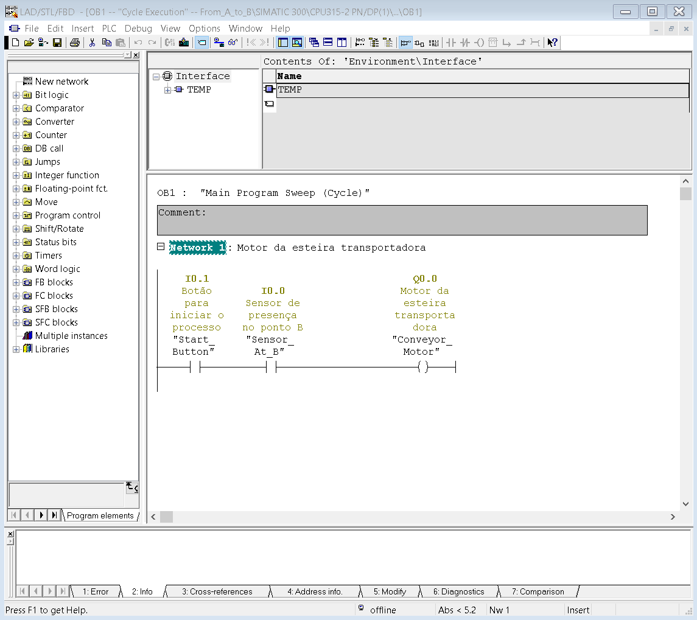
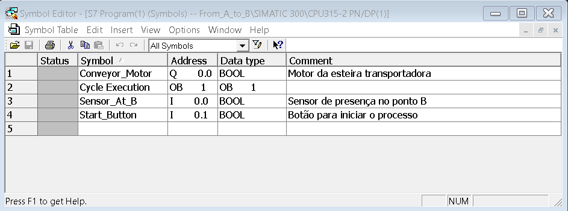

# Scene 01 - From A to B

> **Status:** ✅ Concluído  
> **Dificuldade:** ⭐ Básico 
> **Data Início:** 20/11/2025  
> **Data Conclusão:** 20/11/2025

## 📋 Descrição do Problema

**Objetivo Principal:** Transportar uma caixa até que ela atinja um sensor.

Esta é uma scene básica de transporte onde uma caixa precisa ser movimentada do ponto A (origem) até o ponto B (destino), onde será detectada por um sensor. É a introdução mais simples à automação de transporte de materiais.

## 🎯 Objetivos da Automação

- [x] Iniciar o transporte da caixa
- [x] Mover a caixa através de uma esteira transportadora
- [x] Detectar a chegada da caixa no ponto B através de um sensor
- [x] Parar a esteira quando a caixa atingir o sensor
- [x] Documentar o processo completo

## 🔌 Lista de I/O (Entradas e Saídas)

### Entradas Digitais (DI)

| Endereço | Tag/Nome | Descrição | Tipo de Sensor |
|----------|----------|-----------|----------------|
| I0.0 | Start_Button | Botão para iniciar o processo | Botão NA (Normalmente Aberto) |
| I0.1 | Sensor_At_B | Sensor de presença no ponto B | Sensor óptico/indutivo |

### Saídas Digitais (DO)

| Endereço | Tag/Nome | Descrição | Tipo de Atuador |
|----------|----------|-----------|-----------------|
| Q0.0 | Conveyor_Motor | Motor da esteira transportadora | Motor DC/AC |

### Entradas Analógicas (AI)

| Endereço | Tag/Nome | Descrição | Faixa |
|----------|----------|-----------|-------|
| - | - | Não utilizado nesta scene | - |

### Saídas Analógicas (AO)

| Endereço | Tag/Nome | Descrição | Faixa |
|----------|----------|-----------|-------|
| - | - | Não utilizado nesta scene | - |

## 🧠 Lógica Implementada

### Descrição Geral

A lógica consiste em um controle simples de partida/parada:

1. O operador pressiona o botão START
2. A esteira transportadora é acionada (motor ligado)
3. A caixa começa a se mover do ponto A em direção ao ponto B
4. Quando o sensor detecta a caixa no ponto B, a esteira para
5. O sistema aguarda uma nova ação do operador

### Algoritmo Principal

```
1. Sistema em estado inicial (aguardando comando)
2. SE botão START pressionado ENTÃO
   3. Liga motor da esteira (Q0.0 = 1)
4. ENQUANTO sensor_at_B não detectar FAÇA
   5. Mantém esteira ligada
6. QUANDO sensor_at_B = 1 (caixa detectada) ENTÃO
   7. Desliga motor da esteira (Q0.0 = 0)
8. Sistema retorna ao estado inicial
```

### Networks (Segmentos) Principais

#### Network 1: Partida da Esteira
```
Lógica: Start_Button AND NOT Sensor_At_B → Conveyor_Motor
Descrição: Liga o motor da esteira quando START é pressionado 
e o sensor ainda não detectou a caixa.
```

#### Network 2: Parada da Esteira
```
Lógica: Sensor_At_B → Desliga Conveyor_Motor
Descrição: Quando o sensor detecta a caixa, desliga o motor.
```

## 📊 Diagrama de Estados

```
[IDLE/Parado] 
    ↓ (Start_Button pressionado)
[TRANSPORTE] - Motor ligado, caixa em movimento
    ↓ (Sensor_At_B ativo)
[PARADO NO DESTINO] - Motor desligado, caixa detectada
    ↓ (Reset/Nova operação)
[IDLE/Parado]
```

## 📸 Imagens

### Layout da Scene no Factory IO


### Programa Ladder


### Tabela de Símbolos


### Configuração de Hardware


### Estrutura do Projeto


## 🎬 Vídeo Demonstrativo

[](https://youtu.be/hnoBvjmEk_U)

**Link direto:** [https://youtu.be/hnoBvjmEk_U](https://youtu.be/hnoBvjmEk_U)

**Descrição do vídeo:**  
Demonstração do transporte da caixa do ponto A ao ponto B, mostrando o acionamento da esteira, movimento da caixa e parada ao detectar o sensor.

## 🔧 Configuração e Testes

### Passos para Executar:

1. **Abrir o projeto no Simatic Manager:**
   - Arquivo: `./Projeto/From_A_t/From_A_t.s7p`
   - Ou descompactar: `./Projeto/From_a_t.zip`

2. **Configurar PLCSim:**
   - Iniciar S7-PLCSIM
   - Carregar o programa (Download)
   - Colocar em modo RUN
   - Ou usar simulador alternativo: `./Simulador/plc1.plc`

3. **Abrir Factory IO:**
   - Arquivo: `./FactoryIO/1 - From A to B - S7-300.factoryio`

4. **Configurar Comunicação:**
   - NetToPLCSim configurado
   - Verificar mapeamento de I/O:
     - I0.0 → Start Button
     - I0.1 → Sensor at B
     - Q0.0 → Conveyor Motor

5. **Iniciar Simulação:**
   - RUN no PLCSim
   - Play no Factory IO
   - Pressionar botão START

### Testes Realizados:

- [x] Teste 1: Caixa transportada com sucesso até o sensor
- [x] Teste 2: Motor para corretamente ao detectar a caixa
- [x] Teste 3: Múltiplos ciclos de operação
- [x] Teste 4: Integração STEP 7 com Factory IO funcionando
- [x] Teste 5: Vídeo de demonstração gravado

## 🐛 Problemas Encontrados e Soluções

_Nenhum problema significativo encontrado durante o desenvolvimento desta scene básica._

## 💡 Conceitos Aplicados

- ✅ Lógica combinacional básica (AND, NOT)
- ✅ Controle de partida/parada (start/stop)
- ✅ Uso de sensores digitais
- ✅ Controle de atuadores (motor)

## 🚀 Melhorias Futuras

- [ ] Adicionar contador de caixas transportadas
- [ ] Implementar temporizador para reset automático
- [ ] Adicionar modo automático (ciclo contínuo)
- [ ] Implementar velocidade variável da esteira
- [ ] Adicionar tratamento de erros e alarmes

## 📚 Referências e Recursos

- Factory IO - Getting Started Tutorial
- STEP 7 - Programming Manual
- Ladder Logic Basics

## 📝 Notas Adicionais

**Observações:**
- Esta é a scene mais básica do Factory IO
- Ideal para iniciantes em automação
- Serve como base para entender a integração STEP 7 + Factory IO
- Foco em conceitos fundamentais antes de avançar para lógicas mais complexas
- Projeto desenvolvido em Simatic Manager STEP 7 v5.7
- Hardware target: S7-300

**Arquivos do Projeto:**
- ✅ Projeto STEP 7: `From_A_t.s7p` (e versão compactada .zip)
- ✅ Scene Factory IO: `1 - From A to B - S7-300.factoryio`
- ✅ Simulador alternativo: `plc1.plc`
- ✅ Documentação visual completa (5 imagens)
- ✅ Vídeo demonstrativo: `Simulation.mp4`

---

**Desenvolvido por:** jciterceros  
**Data de Conclusão:** 20/11/2025  
**Última Atualização:** 20/11/2025
